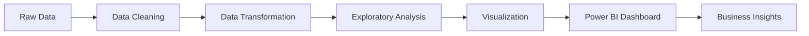

# Retail Sales Data Analytics Dashboard

A comprehensive data analytics project that analyzes retail sales data using **Python (Pandas)** and visualizes insights through interactive **Power BI dashboards**. The project focuses on extracting meaningful business insights such as revenue trends, customer behavior, and regional performance.


## Project Overview

Retail businesses generate large amounts of transactional data, but raw data alone does not provide actionable insights.

This project builds a **complete analytics pipeline** that:

Cleans and preprocesses retail sales data using Python  
Performs Exploratory Data Analysis (EDA)  
Transforms datasets for analytics  
Builds interactive dashboards in Power BI  
Generates insights to support data-driven business decisions

---

## Project Structure

```
Sales-Data-Analytics-Dashboard/
│
├── data/
│   ├── raw_sales_data.csv          # Original raw dataset
│   └── cleaned_sales_data.csv       # Cleaned and processed dataset
│
├── notebooks/
│   └── data_analysis.ipynb          # Jupyter notebook with EDA
│
├── scripts/
│   └── data_cleaning.py             # Python script for data cleaning
│
├── dashboard/
│   └── sales_dashboard.pbix         # Power BI dashboard file
│
├── images/
│   └── dashboard_preview.png        # Dashboard screenshot
│
├── requirements.txt                 # Python dependencies
└── README.md                        # Project documentation
```

---

## 1 Dataset Description

The retail sales dataset contains the following fields:

| Column | Description |
|--------|-------------|
| **Order ID** | Unique order identifier |
| **Order Date** | Date of purchase |
| **Product Category** | Category of product (Electronics, Furniture, Office Supplies) |
| **Product Name** | Name of product |
| **Sales** | Revenue generated |
| **Quantity** | Number of items sold |
| **Region** | Sales region (North, South, East, West) |
| **Customer Segment** | Customer type (Corporate, Consumer, Home Office) |
| **Profit** | Profit generated |
| **Discount** | Discount applied |

**Dataset Size**: 120+ transactions across 2023

---

## Data Processing Pipeline

### 1️Data Collection

Load dataset using Pandas:

```python
import pandas as pd

df = pd.read_csv("data/raw_sales_data.csv")
print(df.head())
```

### 2️ Data Cleaning

Cleaning steps include:
- Removing duplicates
- Handling missing values
- Formatting dates
- Removing invalid records

```python
# Remove duplicates
df.drop_duplicates(inplace=True)

# Format dates
df['Order Date'] = pd.to_datetime(df['Order Date'])

# Handle missing values
df.fillna({'Product Category': 'Unknown', 'Sales': 0}, inplace=True)
```

### 3 Data Transformation

Create additional features for analysis:

```python
# Extract date components
df['Year'] = df['Order Date'].dt.year
df['Month'] = df['Order Date'].dt.month
df['Quarter'] = df['Order Date'].dt.quarter
df['Month Name'] = df['Order Date'].dt.month_name()

# Calculate metrics
df['Profit Margin'] = (df['Profit'] / df['Sales']) * 100
df['Revenue Per Unit'] = df['Sales'] / df['Quantity']
```

### 4️ Exploratory Data Analysis

Key analyses performed:
- 📈 Monthly revenue trends
- 🌍 Sales by region
- 📦 Top performing product categories
- 👥 Customer segment performance

Example analysis:

```python
# Regional sales analysis
regional_sales = df.groupby('Region')['Sales'].sum().sort_values(ascending=False)
print(regional_sales)

# Monthly trend analysis
monthly_trend = df.groupby('Month Name')['Sales'].sum()
monthly_trend.plot(kind='line', marker='o')
```

---

## Power BI Dashboard

An interactive **Power BI dashboard** was created to visualize key insights.

### Dashboard Features

**Revenue KPI indicators**  
**Monthly sales trends**  
**Regional performance maps**  
**Product category analysis**  
**Customer segmentation**  
**Interactive filters and drilldowns**

### How to Use the Dashboard

1. Open `dashboard/sales_dashboard.pbix` in Power BI Desktop
2. Connect to the cleaned dataset in `data/cleaned_sales_data.csv`
3. Refresh data to load latest information
4. Explore interactive visualizations and filters

---

## Key Business Insights

The analytics dashboard helps identify:

 **High revenue generating product categories**  
   - Electronics leads with highest revenue contribution
   - Furniture shows strong profit margins

**Regions contributing the most to sales**  
   - Regional performance varies significantly
   - Opportunity to optimize underperforming regions

**Seasonal patterns in customer purchasing**  
   - Q4 shows peak sales activity
   - Monthly trends reveal seasonal opportunities

**Customer segments with highest profitability**  
   - Corporate segment has highest average order value
   - Consumer segment drives volume

### Strategic Recommendations

1. **Focus marketing efforts** on best-performing regions
2. **Increase inventory** for high-revenue product categories
3. **Develop targeted campaigns** for high-value customer segments
4. **Leverage seasonal trends** for promotional planning
5. **Optimize discount strategies** to improve profit margins

---

## Dashboard Preview


*Note: Add your Power BI dashboard screenshot to the `images/` folder*

---

## Future Improvements

Possible extensions for the project:

- [ ] **Real-time sales analytics** using APIs
- [ ] **Integration with SQL databases** for automated data pipeline
- [ ] **Sales forecasting** using Machine Learning (ARIMA, Prophet)
- [ ] **Automated ETL pipelines** with Apache Airflow
- [ ] **Customer Lifetime Value (CLV)** analysis
- [ ] **Market basket analysis** for product recommendations
- [ ] **Predictive analytics** for inventory optimization
- [ ] **Web-based dashboard** using Plotly Dash or Streamlit

---

## How to Run the Project

### Prerequisites

- Python 3.8 or higher
- Power BI Desktop (for viewing dashboards)
- Jupyter Notebook or JupyterLab

### Installation Steps

**Clone the repository**

```bash
git clone https://github.com/yourusername/sales-data-analytics-dashboard.git
cd sales-data-analytics-dashboard
```

 **Create a virtual environment** (optional but recommended)

```bash
# Windows
python -m venv venv
venv\Scripts\activate

# macOS/Linux
python3 -m venv venv
source venv/bin/activate
```

**Install required libraries**

```bash
pip install -r requirements.txt
```

**Run the data cleaning script**

```bash
python scripts/data_cleaning.py
```

**Open and run the Jupyter notebook**

```bash
jupyter notebook notebooks/data_analysis.ipynb
```

**Open the Power BI dashboard**

```
Open Power BI Desktop → File → Open → Select dashboard/sales_dashboard.pbix
```

---

##  Project Dependencies

```
pandas>=1.5.0
numpy>=1.23.0
matplotlib>=3.6.0
seaborn>=0.12.0
jupyter>=1.0.0
openpyxl>=3.0.0
```

Install all dependencies:

```bash
pip install -r requirements.txt
```

---

##  Project Workflow


</div>
